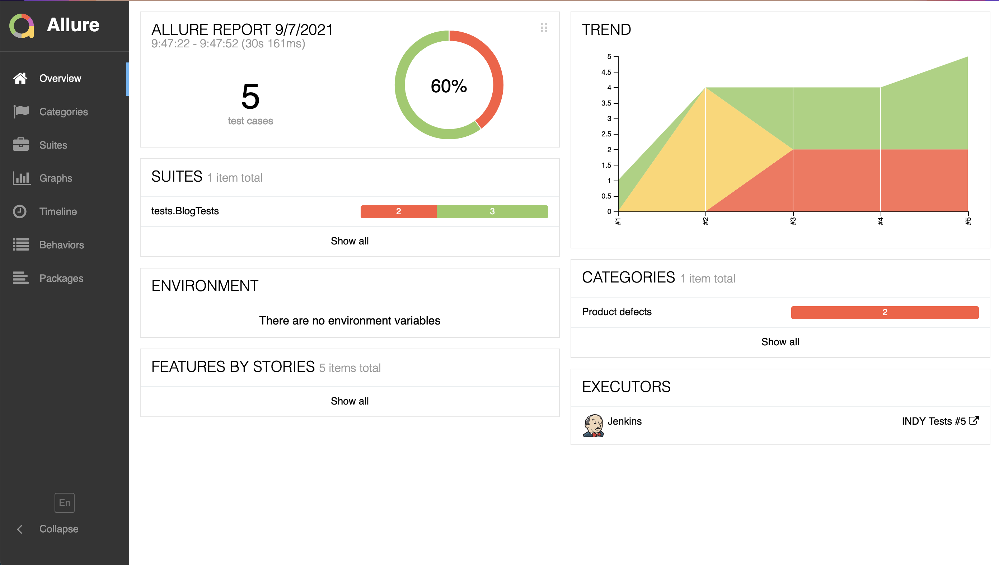
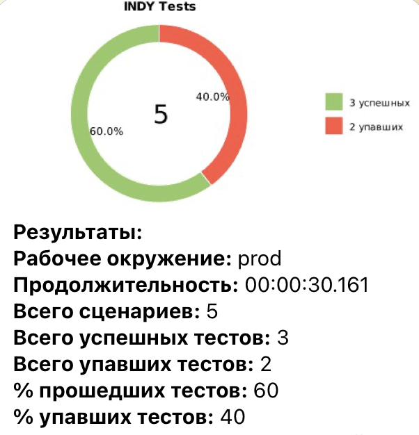

# Indy
This small project contains several simple tests for Indy blog page.


# Run tests:
### To run tests locally use next command:
```bash
gradle clean test
```
### To run tests remotely use next command:
```bash
gradle clean -DremoteDriverUrl=https://%s:%s@selenoid.autotests.cloud/wd/hub/ -DvideoStorage=https://selenoid.autotests.cloud/video/ -Dthreads=1 test
```

### To create report use next command:
```bash
allure serve build/allure-results
```
### After test run next report generates:


### Also there will be a report in Telegram:


### Link to a Jenkins job:
<a target="_blank" href="https://jenkins.autotests.cloud/job/INDY%20Tests/">INDY Tests</a>

